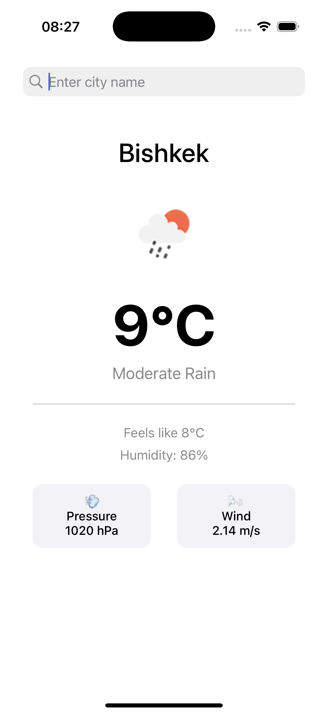
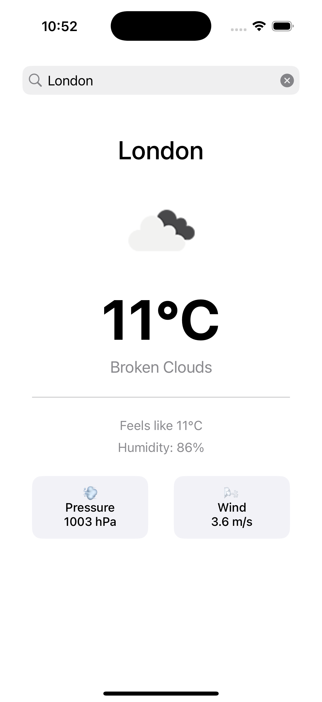

# 🌤️ Weather App

A clean and simple iOS weather application built with UIKit and MVVM architecture.


## 📱 Screenshots

<p align="center">
  
</p>


<p align="center">
  
</p>

## ✨ Features

- 🔍 **City Search** - Search weather for any city worldwide
- 🌡️ **Current Weather** - Real-time temperature and conditions
- 💨 **Detailed Information** - Humidity, pressure, wind speed, and "feels like" temperature
- 🎨 **Clean UI** - Modern, minimalist design with weather icons
- 💾 **Last Search Memory** - Automatically remembers your last searched city
- 🌐 **OpenWeather API** - Reliable weather data from OpenWeatherMap

## 🏗️ Architecture

This project follows the **MVVM (Model-View-ViewModel)** architecture pattern:

```
WeatherApp/
├── Models/              # Data models (WeatherData, WeatherModel)
├── Views/               # UI Components (WeatherViewController)
├── ViewModels/          # Business logic (WeatherViewModel)
├── Services/            # Network layer (WeatherService)
└── Helpers/             # Utilities (Constants, UserDefaultsManager)
```

## 🛠️ Technologies Used

- **UIKit** - UI framework
- **MVVM Pattern** - Clean architecture
- **URLSession** - Networking
- **Codable** - JSON parsing
- **UserDefaults** - Local data persistence
- **Auto Layout** - Responsive UI (NSLayoutConstraint)
- **OpenWeatherMap API** - Weather data provider

## 📋 Requirements

- iOS 15.0+
- Xcode 14.0+
- Swift 5.0+
- OpenWeatherMap API Key

## 🚀 Installation

1. **Clone the repository**
   ```bash
   git clone https://github.com/yourusername/WeatherApp.git
   cd WeatherApp
   ```

2. **Get API Key**
   - Sign up at [OpenWeatherMap](https://openweathermap.org/)
   - Get your free API key

3. **Configure API Key**
   - Open `Helpers/Constants.swift`
   - Replace `YOUR_API_KEY` with your actual key:
   ```swift
   static let apiKey = "your_actual_api_key_here"
   ```

4. **Run the project**
   - Open `WeatherApp.xcodeproj` in Xcode
   - Select a simulator or device
   - Press `Cmd + R` to build and run

## 📖 How It Works

### MVVM Flow

1. **View (WeatherViewController)** - User searches for a city
2. **ViewModel (WeatherViewModel)** - Processes the request
3. **Service (WeatherService)** - Makes API call to OpenWeatherMap
4. **Model (WeatherData)** - Parses JSON response
5. **ViewModel** - Converts data to display format (WeatherModel)
6. **View** - Updates UI with new weather information

### Key Components

**WeatherService**
- Singleton pattern for network requests
- Error handling with custom `NetworkError` enum
- Codable for JSON decoding

**WeatherViewModel**
- Closures for data binding (`onWeatherUpdated`, `onError`, `isLoading`)
- Weak self to prevent memory leaks
- Main thread dispatch for UI updates

**WeatherViewController**
- Programmatic UI
- Auto Layout constraints
- SearchBar delegate for city input


## 🔮 Future Improvements

- [ ] 5-day weather forecast
- [ ] Current location detection (CoreLocation)
- [ ] Favorites list
- [ ] Weather animations
- [ ] Dark mode optimization
- [ ] Unit tests
- [ ] SwiftUI version

## 📝 API Reference

This app uses the [OpenWeatherMap Current Weather API](https://openweathermap.org/current):

```
https://api.openweathermap.org/data/2.5/weather?q={city}&appid={API_KEY}&units=metric
```

## 👤 Author

**Elbar**
- GitHub: [link](https://github.com/Elbar)
- LinkedIn: [link](https://linkedin.com/in/rocketvista)

## 📄 License

This project is licensed under the MIT License - see the [LICENSE](LICENSE) file for details.

## 🙏 Acknowledgments

- Weather data provided by [OpenWeatherMap](https://openweathermap.org/)
- Weather icons from OpenWeatherMap
- Built as a learning project for iOS development

---

⭐️ If you found this helpful, please give it a star!
